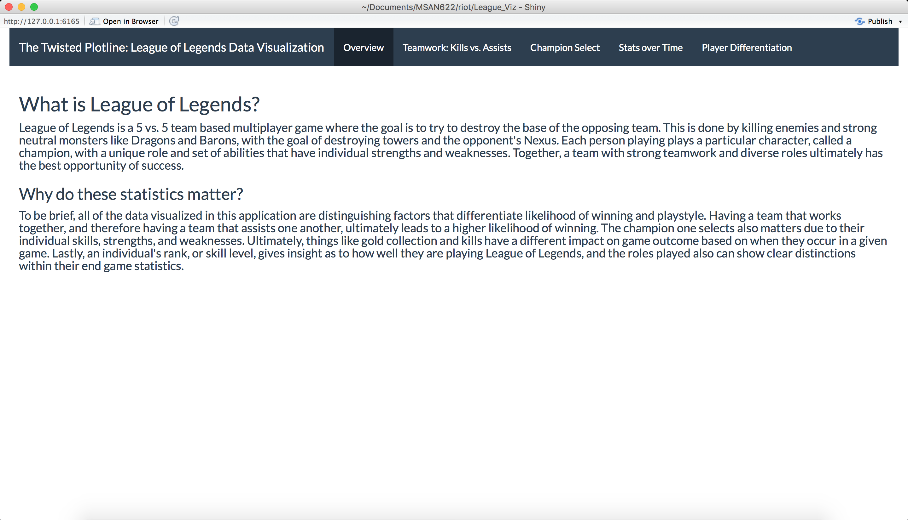
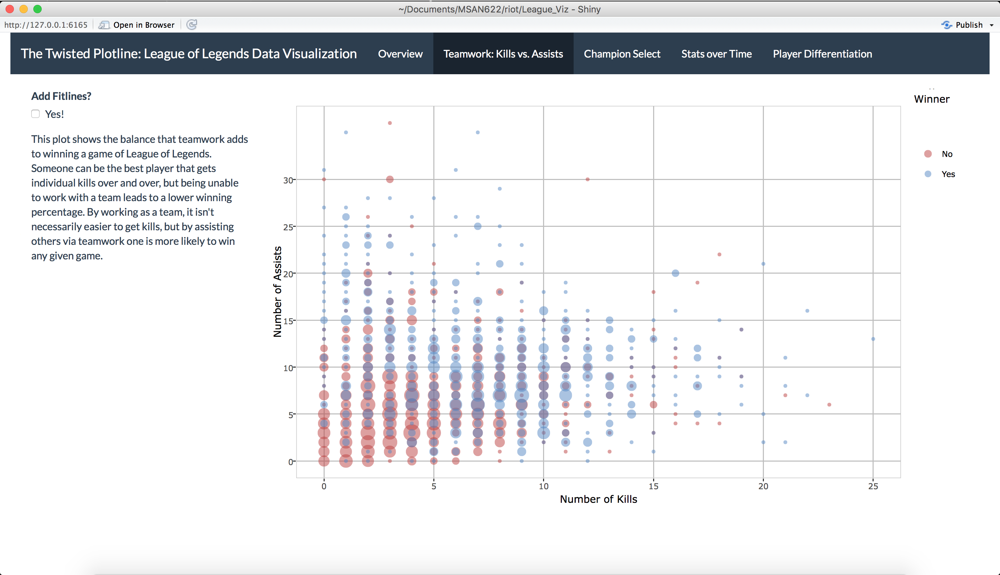
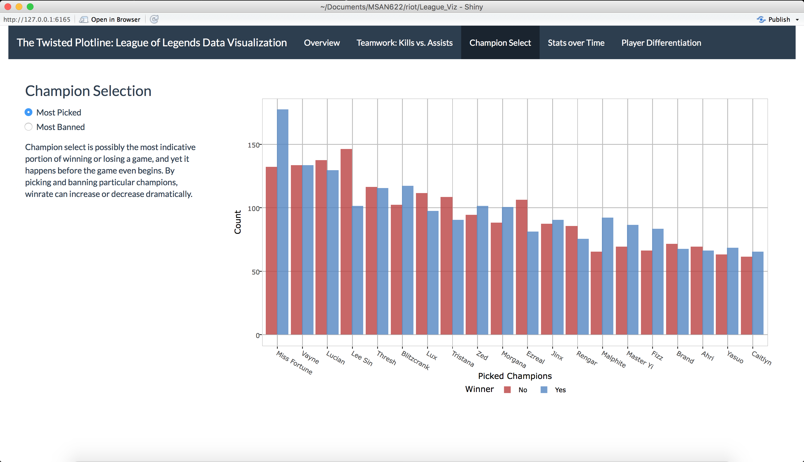
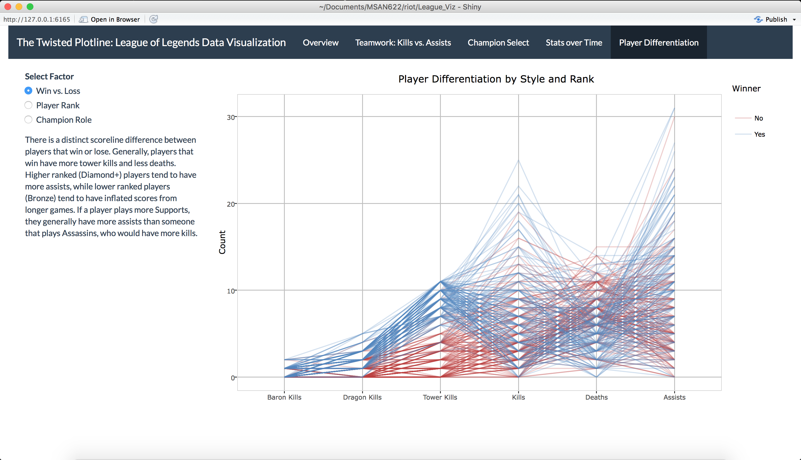

# The Twisted Plotline
| **Name**  | Cameron Carlin, Soi Chong Ma (Albert)  |
|----------:|:-------------|
| **Email** | CameronSCarlin@gmail.com   sma21@dons.usfca.edu|

## Introduction

League of Legends is a 5 vs. 5 team based multiplayer game where the goal is to try to destroy the base of the opposing team. This is done by killing enemies and strong neutral monsters like Dragons and Barons, with the goal of destroying towers and the opponent's Nexus. Each person playing plays a particular character, called a champion, with a unique role and set of abilities that have individual strengths and weaknesses. Together, a team with strong teamwork and diverse roles ultimately has the best opportunity of success. 

The following packages are needed for running this visualization:

- `ggplot2`
- `dplyr`
- `d3treeR`
- `GGally`
- `ggplot2`
- `plotly`
- `shiny`
- `shinythemes`
- `tidyr`
- `treemap`
- `zoo`

To run this, please run `shiny::runGitHub(“riot”,username=“CameronSCarlin”,subdir = “League_viz”)`

## Summary

To be brief, all of the data visualized in this application are distinguishing factors that differentiate likelihood of winning and playstyle. Having a team that works together, and therefore having a team that assists one another, ultimately leads to a higher likelihood of winning. The champion one selects also matters due to their individual skills, strengths, and weaknesses. Ultimately, things like gold collection and kills have a different impact on game outcome based on when they occur in a given game. Lastly, an individual's rank, or skill level, gives insight as to how well they are playing League of Legends, and the roles played also can show clear distinctions within their end game statistics.

## Data Description

The raw data were collected via as 10 JSON files, each contains 100 matches with a total of 1000 matches and consists of 10000 player observations (10 players per match). Each player observation has its match statistics as the following:

### Numerical

- Kills
- Deaths
- Assits
- Gold Earned
- Creeps Killed
- Damage Dealt
- Experience Gained

### Categorical

- Player Ranks
- Champions
- Champions Roles
- Winner

## UI

## Techniques and Screenshots

- The first plot, comparing kills and assists, is a scatterplot with bubble size as a count at each point and a fitline for winning or losing. This plot has hover capabilities and the ability to remove either the winning or losing points.

- The second plot displays histogram of which champion has the highest picks. It also has the option for user to look at which champion has the highest number of bans. The goal of this plot is to provide insights of which champion is most popular in gmae.

- The third plot is a line plot of different team statistics such as gold earned against total duration of the match. The line plot is distinguished by the winning and losing team such that one could gain insights which match statistics matters the most. User can interact this plot by choosing different types of match statistics.

- The fourth plot is a parallel coordinate plot showing the links among different match statistics. Furthermore this plot can be grouped by not only winning/losing teams but it can also be grouped by champion roles and player ranks.

